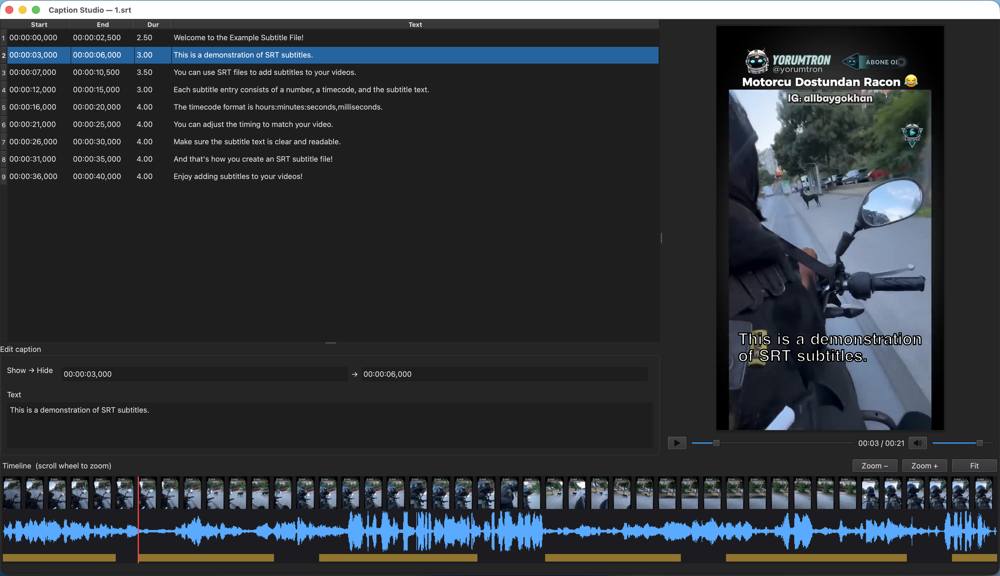

# Caption Studio

A small desktop app for previewing and fine-tuning **`.srt` subtitles over portrait (9:16) social-media video** — built for an amateur captioning workflow (Whisper transcription → proofread → style for TikTok / Reels / Shorts).



> _Screenshot to be added by the maintainer — drop a PNG at `docs/screenshot.png`._

## Features

- **Load a video + its `.srt`** — auto-loads a sibling `*.short.srt` / `*.srt`.
- **Burn-in caption preview over the actual video**, drawn in the video's own pixel space so line widths match the final frame.
- **Aspect-locked portrait video box** — handles phone videos stored landscape with a rotation flag (probed via ffmpeg).
- **Live line-wrap by character budget** — balanced, never splits a word. Manual line breaks you type in the editor are honored verbatim.
- **Playback transport** — play/pause, seek, and a **volume / mute** control (level is remembered).
- **Caption table + text/timing editor** — the active row highlights and follows playback.
- **Bottom timeline** — filmstrip thumbnails, high-resolution audio waveform, caption blocks, and a playhead. Scroll-wheel zoom centered on the playhead, plus Zoom −/＋/Fit.
- **System font picker + size + Bold/Italic + text color** (Caption → Style…).
- **Dark theme.**
- **Open Recent** menu (last 10 videos); remembers your font/style and window geometry.
- **Save** writes the `.srt` wrapped at the current width (or flat); prompts before overwriting and defaults to a save name that won't clobber the source.
- **Prompts to save** unsaved caption edits before you quit or switch files; an unsaved file shows a `•` in the title bar.

## Requirements

- **Python 3.11** (developed and tested on 3.11.9; 3.10–3.12 should work).
- Dependencies (installed by the setup script):
  - `PySide6` — Qt 6.5+, ships the FFmpeg media backend so `.mp4` / H.264 plays with no extra codecs.
  - `numpy`
  - `imageio-ffmpeg` — bundles the ffmpeg binary used for the waveform, thumbnails, and rotation/size probe. **No separate ffmpeg install needed.**

No other system dependencies. **No GPU, CUDA, or ML dependencies** — it's a lightweight GUI. Cross-platform (Windows / macOS / Linux); the primary target is Windows.

## Install

Clone the repo, then run the setup script for your platform. It creates a `venv/` and installs the dependencies.

```bash
# Windows (cmd)
setup.bat

# Windows (PowerShell)
.\setup.ps1

# macOS / Linux
chmod +x setup.sh run.sh   # first time only
./setup.sh
```

## Run

```bash
# Windows (cmd)
run.bat [video]

# Windows (PowerShell)
.\run.ps1 [video]

# macOS / Linux
./run.sh [video]
```

Or directly, if your environment already has the dependencies:

```bash
python caption_studio.py [video]
```

The optional `[video]` argument opens that file on launch; otherwise the app reopens your last video.

## Usage

1. **Open a video** (File → Open, or pass it on the command line). Caption Studio auto-loads a sibling `.srt` next to it.
2. **Tune the Line width** to set the character budget per line — the preview re-wraps live.
3. **Caption → Style…** to pick the font, size, Bold/Italic, and text color.
4. Type **manual line breaks** in the editor where you want them — they're honored verbatim.
5. **Scroll** over the timeline to zoom (centered on the playhead); use Zoom −/＋/Fit to reframe.
6. **Save As** writes the `.srt` wrapped at the current width (or flat), with a default name that won't overwrite the source.

### How wrapping works

Each caption is wrapped to a **character budget** (the Line width). The wrapper balances lines so they're roughly even and **never splits a word**. If you put your own line breaks in the editor text, those are kept exactly as typed instead of being re-wrapped.

## Bonus: `wrap_srt.py` CLI

A standalone, pure-stdlib command-line tool (no dependencies) that wraps an existing `.srt` / `.vtt` to a character budget:

```bash
python wrap_srt.py <file.srt|file.vtt> [max_chars]
```

`max_chars` defaults to `18`. Example: `python wrap_srt.py captions.srt 24`.

## License

[MIT](LICENSE) © 2026 Nusret Suzme
